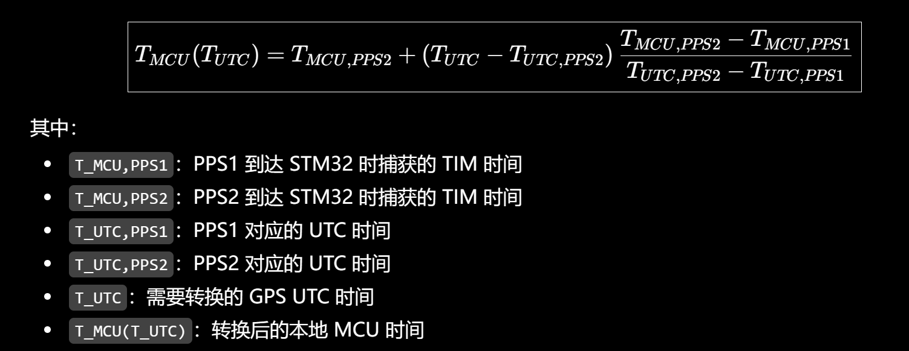

# Flight — STM32H723 组合导航飞控固件

基于 RT-Thread 5.3.0 的组合导航飞控工程,目标芯片 STM32H723ZGT6 (Cortex-M7),
开发板 FK723M1-ZGT6。传感器: ADIS16505 (IMU, 1kHz) + UM982 (GNSS, 10Hz) +
BMM350 (磁力计, 100Hz) + BMP585 (气压计, 100Hz),融合算法为 KF-GINS
(21 状态 EKF 宽松耦合)。

## 目录

1. [项目结构](#项目结构)
2. [传感器数据流架构](#传感器数据流架构) — 统一执行流程 / 各链处理与异常值处置 / 各传感器落地 / UM982 变体
3. [时间同步框架](#时间同步框架) — 双时间体系 / 总体框图 / PPS 校准 / 映射公式 / GPS 缺失降级
4. [传感器数据结构](#传感器数据结构)
5. [构建与烧录](#构建与烧录)
6. [使用说明](#使用说明)
7. [已知问题与遗留项](#已知问题与遗留项)
8. [提升路线图](#提升路线图)

> **阅读须知**: 本文档是全项目设计文档,"传感器数据流架构"与"时间同步
> 框架"两章描述目标架构与实现约定; 各链路/时间框架的实现现状见
> [各传感器落地 → 现状与迁移](#各传感器落地) 与
> [时间同步框架 → 现状](#现状)。传感器驱动细节与 FinSH 命令速查见
> `middleware/README.md`。**当前待解决问题清单见
> [已知问题与遗留项](#已知问题与遗留项)。**

## 项目结构

```
Flight/
├── applications/              # 应用层
│   ├── main.c                 #   入口: LED/按键 + 调试输出链路装配
│   ├── app_out.h / app_out.c  #   USART1 输出层公共设施: 共享写互斥 +
│   │                          #   STREAM 兜底清除 + tiny klibc 定点格式化
│   ├── out_vofa.c             #   KF-GINS 快照 -> VOFA+ JustFloat 二进制帧
│   ├── out_imu.c              #   IMU 原始样本 -> 带标记文本 (IMUOUT_ENABLE 门控)
│   ├── out_gnss.c             #   UM982 定位解 -> 带标记文本
│   ├── out_gins.c             #   KF-GINS 融合结果 -> 带标记文本
│   ├── out_mag.c              #   BMM350 原始+校准 -> 带标记文本
│   ├── out_baro.c             #   BMP585 原始+校准 -> 带标记文本
│   │                          #   (每条链路 = 线程 + init + FinSH 命令, 各自成文件)
│   ├── cmd_cpuload.c          #   FinSH 辅助命令: cpuload
│   └── SConscript
├── board/                     # 板级支持包 (BSP)
│   ├── board.c / board.h      #   板级初始化, USART1 console (460800 8N1)
│   ├── CubeMX_Config/         #   CubeMX 工程配置
│   │   ├── Flight.ioc         #     CubeMX 引脚/外设配置 (硬件配置以此为准)
│   │   ├── Inc/               #     生成的头文件 (main.h, stm32h7xx_hal_conf.h, stm32h7xx_it.h)
│   │   └── Src/               #     生成的源文件 (stm32h7xx_hal_msp.c, stm32h7xx_it.c)
│   ├── Kconfig                #   板级配置菜单
│   ├── linker_scripts/        #   链接脚本 (GCC link.lds / Keil link.sct / IAR link.icf)
│   └── SConscript
├── middleware/                # 传感器数据处理与组合导航中间件 (详见 middleware/README.md)
│   ├── sensor/                #   传感器驱动层: ADIS16505 / BMM350 / BMP585 / W25Q64
│   ├── protocol/              #   纯协议解析 (不含硬件访问)
│   │   ├── nmea/              #     um982_nmea: NMEA RMC/GGA/ZDA → GNSS PVT
│   │   └── mavlink/           #     MAVLink 库 + 链路层封装
│   ├── data/                  #   原始数据环形缓冲区层 (imu / gnss / gnss_raw / mag / baro
│   │                          #   + record_ring 定长记录环公共层, 四模块共用)
│   ├── calibration/           #   磁力计椭球校准 + 气压计基准校准 (参数经 param_calib 持久化)
│   ├── param_calib/           #   飞控参数分区存储 (W25Q64): 分区引擎 + calib/nav/sys 三参数域,
│   │                          #   追加式记录 + CRC32 + 磨损均衡, 掉电原子
│   ├── gins/                  #   KF-GINS 桥接: gins 解算线程 (1kHz) + ginsaux 消费线程
│   │                          #   + C++ 对齐 new 堆适配 (aligned_new.cpp)
│   ├── KF-GINS/               #   上游组合导航算法内核 (C++, 21 状态 EKF, 最小嵌入)
│   ├── so3/                   #   SO(3) 姿态误差解算 (验收测试用)
│   ├── control/               #   (预留, 暂空; 参数分区预留 ctrl 分区)
│   ├── timebase               #   时间同步基座
│   ├── SConscript             #   注: sensor(驱动)/protocol(协议) 等子模块构建入口
│   └── README.md              #   数据流架构 + FinSH 命令速查 (必读)
├── rt-thread/                 # RT-Thread 内核源码 (5.3.0): src / components / libcpu / include
├── libraries/                 # ST 芯片级支持
│   └── HAL_Drivers/           #   RT-Thread STM32 驱动层 (drv_common, uart/i2c/spi 等) + CMSIS
├── packages/                  # RT-Thread 在线软件包
│   ├── CMSIS-Core-latest
│   └── stm32h7_hal_driver-latest / stm32h7_cmsis_driver-latest
├── doc/                       # 硬件参考资料
│   ├── ADIS16505/             #   IMU datasheet + ADI no-OS 官方驱动源码
│   ├── BMM350/                #   磁力计 datasheet + 参考例程 (STM32 / Raspberry Pi Pico)
│   ├── BMP585/                #   气压计 datasheet
│   ├── FMT-Firmware/          #   飞控参考程序
│   ├── FK723M1-ZGT6 原理图.pdf
│   ├── LGroundControl-V1.1.0-用户手册.pdf
│   ├── STM32CubeIDE_For_VS_CodeV3.8.0.pdf
│   └── Flight.xlsx            #   硬件配置清单
├── figures/                   # 文档图片 (pps-calibration.png)
├── cfg/                       # OpenOCD 调试配置 (按探针二选一, 不接入构建系统)
│   ├── daplink.cfg            #   DAPLink (CMSIS-DAP, SWD 10MHz)
│   └── stlink.cfg             #   ST-LINK V3 MINIE (SWD 15MHz)
├── .run/                      # CLion 持久化运行配置 (Flight Debug: OpenOCD+stlink.cfg)
├── build_host/                # 主机侧调试与质量工具 (不参与固件编译; 分组索引见其 README.md)
│   ├── *.py                   #   Python 探针 / 验证 / 质量扫描 (strict_scan*, swd_* 等)
│   ├── *.gdb / *.ocd          #   OpenOCD/gdb 调试片段 (断点、线程、堆诊断等)
│   ├── *.ps1                  #   PowerShell 串口抓取 / 烧录辅助脚本
│   ├── data/                  #   一次性数据捕获 (磁标定数据集 / 标定槽位样本 / 气压计记录)
│   ├── test10/                #   SWD 10 轮回归 17 判据证据日志 (见"已知问题 #17")
│   └── ell_test.exe           #   主机端椭球拟合单元测试
├── build/                     # SCons 构建产物 (已 gitignore)
├── cmake-build-debug/         # CLion/CMake 构建产物 (已 gitignore; 最终目标 Flight.elf)
├── .config                    # Kconfig 生成的 RT-Thread 配置
├── rtconfig.h                 # 由 .config 生成的配置头文件
├── rtconfig.py                # RT-Thread 工具链配置 (arm-none-eabi-gcc, cortex-m7)
├── SConstruct / SConscript    # SCons 构建入口
├── CMakeLists.txt             # CLion/CMake 交叉编译工程 (与 SCons 等价)
└── Kconfig                    # 顶层配置菜单
```

## 传感器数据流架构

### 统一执行流程 (目标设计)

四个传感器共用同一事件驱动模型, 唯一区别是事件源 (DR/INT 引脚或
UART 字节到达) 与总线 (SPI/I2C/UART)。本节为四链统一的目标架构,
各链实现进度见 [各传感器落地 → 现状与迁移](#各传感器落地):

```
传感器
  │
  │ DR / INT
  ▼
┌──────────────────────┐
│      EXTI ISR        │
│                      │
│  ① 读取 TIM->CNT     │
│     ↓                │
│  cnt_event           │
│     ↓                │
│  ② 启动 SPI/I2C DMA  │
└──────────┬───────────┘
           │
           │ EXTI ISR EXIT
           ▼
      DMA 硬件搬运
           │
           ▼
┌──────────────────────┐
│      DMA ISR         │
│                      │
│  ③ 确认DMA完成       │
│     ↓                │
│  ④ 检查DMA状态       │
│     ↓                │
│  ⑤ 通知处理线程      │
└──────────┬───────────┘
           │
           │ DMA ISR EXIT
           ▼
┌──────────────────────┐
│    数据处理线程      │
│                      │
│  cnt_event           │
│    ↓                 │
│  时间转换            │
│    ↓                 │
│  T_MCU (µs)          │
│                      │
│  解析                │
│    ↓                 │
│  校准                │
│    ↓                 │
│  单位转换            │
│    ↓                 │
│  质量检查            │
└──────────┬───────────┘
           │
           ▼
   Ring Buffer (每传感器独立)
           │
           ▼
        KF-GINS
```

关键设计约定:

1. **时戳在 ISR 捕获**: `cnt_event` 由 `TIM->CNT` 在 EXTI ISR 内
   读取, T_MCU 时戳精度 = 定时器分辨率, 与总线传输、线程调度
   延迟完全解耦。
2. **ISR 最短路径**: EXTI/DMA 两个 ISR 只做"捕获时戳 + 启动搬运"
   与"确认 + 通知", ISR 内不做任何总线等待与数据解析,
   解析/校准/换算全部推迟到线程上下文。
3. **每传感器独立唤醒缓冲区**: 缓冲区、信号量、处理线程均不
   共享, 四链唤醒互不干扰 (故障隔离)。
4. **单消费方 + 挤旧留新**: 每条链一个常驻消费者, 样本只能 pop
   一次; 满时挤掉最旧计入 lost, 新数据永远进得来 (校准采集是
   维护窗口内的第二消费者, 属预期分流)。

### 流程分步说明

- **EXTI ISR (①②)**: 只做两件事即退出 —— ① 读 `TIM->CNT` 捕获
  事件时刻计数值 `cnt_event` (时戳锚定在硬件事件时刻, 不受 DMA
  传输与线程调度延迟影响); ② 启动 SPI/I2C DMA。
- **DMA 硬件搬运**: CPU 零参与, 原始寄存器帧由 DMA 搬入 RAM
  (ADIS 为 22B SPI burst, 搬运完成后 CS 拉高 + D-Cache 失效)。
- **DMA ISR (③④⑤)**: 确认传输完成 → 检查 DMA 状态 (异常计数,
  触发链路复位/重试) → 释放本传感器专属信号量通知处理线程, 退出。
- **数据处理线程** (被专属信号量唤醒, 耗时操作全部在此上下文):
  - `cnt_event → 时间转换 → T_MCU`: TIM2 计数值结合溢出累计合成
    64 位时戳 `T_event` (µs, 双时间体系与换算见
    [时间同步框架](#时间同步框架));
  - **解析**: 原始帧 → 物理量 (ADIS burst 帧 / BMM350 Bosch OTP
    补偿 / BMP585 温压寄存器);
  - **校准**: 磁力计椭球硬/软磁校正 + 轴映射到机体前右下 (气压
    基准偏移属**导航参数**而非传感器校准, 归 ginsaux 消费侧施加,
    见各链落地);
  - **单位转换**: LSB → rad/s / m/s² / µT / Pa / °C;
  - **质量检查**: 帧校验 / 状态位 / 连续性 / 物理范围 —— 不合格
    样本丢弃并计数 (各链具体检查项见各链落地, 检出后的分级处置
    见 [异常值处理流程](#异常值处理流程-三级递进))。
  - **各链落地** (五步框架在四条链上的具体内容, 目标方案; UM982
    事件源为字节流、无 cnt_event, 细化流程见
    [UM982 UART 变体](#um982-uart-变体-两级环形缓冲区)):
    - **ADIS16505** (两级: adis_dr 驱动线程 → imudata 采集线程):
      驱动线程对 22B burst 帧做 校验和 (DIAG..CNTR 共 18B,
      16-bit 减法归零) → DIAG_STAT 检查 (非零记异常, 连续异常
      触发链路复位与 burst 重同步) → DATA_CNTR 连续性检查
      (cntr_gap>1 记丢拍), 帧入驱动帧队列; imudata 线程对快照
      做 DATA_CNTR 去重 → 按量程档灵敏度 LSB→rad/s / m/s²、
      0.1°C/LSB→°C → 轴映射到机体前右下 → 连同 data_cnt push
      `imu_data` 环 (dt 由 gins 按 DATA_CNTR 差分计算, 丢拍期
      EKF 按实际间隔积分, 不误当作均匀 1ms)。
    - **BMM350**: 驱动层用初始化下载的 32B OTP 系数做灵敏度/
      偏置/温漂/交叉轴补偿 (Bosch 算法, 原始计数→mGauss) →
      mGauss→µT → 椭球硬/软磁校准 (传感器系, double 精度,
      无校准参数时直通) → 轴映射到机体前右下 → 干扰检查
      (模值应落在地磁 20~100µT 量级, 超限置 quality 干扰位;
      **位于低通之前** —— 低通会抹平瞬时尖峰, 被平滑的污染
      样本须先行检出) → 一阶 EMA 低通 (τ 可配, 0 即旁路) →
      push `mag_data` 环 (quality 随样本传递, ginsaux 据此降权)。
    - **BMP585**: 24-bit 小端符号扩展 (NVM 出厂补偿后的数字
      输出, 免用户补偿公式) → 定点换算 (signed,24,6)→Pa /
      (signed,24,16)→°C → 范围检查 (300~1200 hPa、-40~+85°C,
      超限丢弃计数, 拦总线毛刺/错帧) → push `baro_data` 环;
      气压基准偏移由 ginsaux 消费侧施加 (barocal 热更新即时
      生效, 不受环内旧样本影响)。
    - **UM982**: 组句 ($/\r/\n 状态机, 超长丢整句) → NMEA
      校验和 ($..*HH, 协议层内建拒绝垃圾句) → RMC/GGA/ZDA
      解析 (GGA 只有时间无日期, 由最近 RMC/ZDA 补齐) → 质量
      检查 (RMC 状态 'A' 才置 pos_valid, fix_type 达单点定位
      以上才可用) → UTC 双分流与 `T_event` 换算 (见
      [UM982 UART 变体](#um982-uart-变体-两级环形缓冲区) 与
      [时间同步框架](#时间同步框架)) → push `gnss_data` 环。
- **Ring Buffer (每传感器独立唤醒缓冲区)**: 处理线程 push 样本并
  释放本链信号量, 唤醒该链唯一常驻消费者; 满时挤掉最旧样本计入
  lost (新数据永远进得来), 单消费方语义。
- **KF-GINS**: gins 线程 (1kHz) 排空 IMU/GNSS 环做 EKF 时间更新
  与位置/速度观测更新; ginsaux 线程消费磁/气压环做磁航向与气压
  高度观测 (Pa→高度换算在引擎内)。

### 异常值处理流程 (三级递进)

质量检查发现异常后不止"丢弃"一个动作, 按影响范围分三级处置、
逐级升级; 各级以**分类计数**为输入, 处置全程可观测 (FinSH 状态
命令 imudata / magdata / barodata / gnssdata / gnssraw):

1. **样本级** (处理线程内, 每帧实时) —— 单次异常按"可纠正则
   纠正, 不可纠正则丢弃"处置:
   - 可纠正: ADIS 丢拍 (cntr_gap>1) **不丢样本**, 带 dt 入环由
     EKF 按实际间隔积分; NMEA 垃圾句丢弃不影响后续句重组;
   - 不可纠正: 校验和 / DIAG_STAT / 物理范围 / fix 无效 → 丢弃
     样本 + **分类计数** (checksum / diag / range / fix ...),
     计数是下一级的升级依据。
2. **链路级** (处理线程内, 滑动窗口统计) —— 单次丢弃是常态
   噪声, 持续异常才是故障; 窗口 (如 1s) 内错误率超阈值即触发
   链路恢复, 动作逐级尝试、恢复期间本链停供样本:
   - ADIS: burst 重同步 → 芯片软复位/重配置 → 链路复位重启 DMA;
   - BMM350/BMP585: I2C 总线恢复 (clock 拉扯解除从机卡死) →
     芯片软复位 + 重下配置 (BMM350 需重走 OTP 下载流程);
   - UM982: 外部设备无链路可复位, 持续计数 + ulog 告警;
     PPS 配对违例由四道门槛自身消化 (违例即丢本对);
   - 本级与故障降级看门狗**互补**: 看门狗 (超时路径) 拦"无
     数据", 本级 (错误率路径) 拦"有数据但持续坏", 二者归并
     到同一恢复入口。
3. **观测级** (gins/ginsaux 消费线程) —— 融合侧最后一道防线:
   - 时戳无效的样本跳过: `T_event`=0, 或破坏单调性/增量超界
     —— 单消费方按序 pop, 检查 T_event 单调递增且增量合理
     (IMU ∈ (0,10ms]、GNSS ∈ (0,1.5s]、磁/气压 ∈ (0,100ms];
     详见 [时间同步框架](#时间同步框架));
   - 磁干扰样本 (quality 干扰位) **降权而非丢弃**;
   - EKF 新息 (innovation) 检验: 观测残差超门槛的量测降权或
     拒绝, 防个别漏检异常值污染状态估计 (引擎侧配合项)。

### 各传感器落地

四条链路的事件源、总线、唤醒缓冲区、信号量、处理线程完全独立,
任一传感器断线/总线卡死/缓冲拥塞只影响本链:

| 传感器 | 事件源 (DR/INT) | 总线搬运 | 数据率 | 一级唤醒 (信号量) | 样本环 (信号量) | 消费线程 |
| --- | --- | --- | --- | --- | --- | --- |
| ADIS16505 | DR = PA4 (EXTI4) | SPI1 burst 22B (DMA) | 1kHz | 驱动帧队列×4 (`adispr`) | imu_data 环 512 样本 (`imutrig`/`imudat`) | gins (p9) |
| UM982 | 字节到达 (UART 变体) | USART2 DMA_RX (460800, 空闲线批量指示) | 10Hz | gnss_raw_data 字节环 4KB (`gnssrsem`) | gnss_data 环 32 样本 (`gnssdat`) | gins (p9) |
| BMM350 | INT = PB5 (EXTI9_5, 预留) | I2C1 | 100Hz | — | mag_data 环 128 样本 (`magdat`) | ginsaux (p10) |
| BMP585 | INT = PE13 (EXTI15_10, 预留) | I2C2 (DMA2) | 100Hz | — | baro_data 环 128 样本 (`bardat`) | ginsaux (p10) |

- **两级唤醒**: ADIS 与 UM982 各有两级"唤醒缓冲区+信号量"
  (驱动帧队列/字节环 → 采集/解析线程 → 样本环), BMM350/BMP585
  为单级 (处理线程直接 push 样本环)。
- **I2C 是否走 DMA**: BMP585 (I2C2) 挂 DMA2, 完整走"EXTI→DMA"
  模型; BMM350 (I2C1) 为中断读 —— 400kHz 下读 18B ≈ 0.45ms,
  远小于 10ms 帧周期, DMA 非必需, 迁移到 EXTI 事件源时再按模型
  统一补 DMA 或保持中断读均可。
- **故障降级**: 各链处理线程等待超时进入看门狗 (ADIS 驱动线程
  5ms: DMA 卡死复位 / DR 停止退化轮询; imudata 线程 5ms: 主动读
  设备刷新快照), 传感器拔线不会挂死系统 —— 超时路径与
  [异常值处理流程](#异常值处理流程-三级递进) 链路级的错误率路径
  互补, 归并到同一恢复入口。
- **校准维护窗口**: 磁/气压校准与导航参数持久化 (`calib_store_save` /
  `nav save`) 写 W25Q64 (OCTOSPI1 间接模式, middleware/param_calib):
  编程/擦除期间 CPU 照常取指执行、中断照常响应, **不关全局中断**,
  四链 EXTI/DMA 不停摆; 器件忙等待在保存线程上下文 mdelay 轮询,
  仅该线程阻塞 (页编程 ≤3ms/页, 4KB 扇区擦 ≤400ms)。校准经 FinSH
  命令手动触发, 天然避开飞行/记录窗口; W25Q64 缺失时自动降级:
  参数仅本次上电有效, 系统其余部分不受影响。
- **现状与迁移**: ADIS16505 已完全按本流程实现 (含 SPI DMA burst 与
  cnt_event 时戳捕获 —— DR EXTI ISR 内 `timebase_now_us()` 按槽位打戳);
  BMM350/BMP585 的 INT 引脚硬件已预留, 当前事件源为 10ms 周期采集,
  T_event 已在采样触发时刻打戳 (T_MCU 时基), 迁移到本流程只需接上 INT
  线、把事件源换成 EXTI (缓冲区与线程结构不变); UM982 的接收线程
  (gnssrx)、解析线程与两级缓冲均已就位, 字节环生产者已接入。

### UM982 UART 变体 (两级环形缓冲区)

GNSS 无 DR/INT 引脚, 事件源为 USART2 字节到达; 与统一流程的差别是用
"驱动层 RX 环 → 专属字节环"两级缓冲替代 EXTI→DMA, 组句/校验/解析/换算
全部在线程上下文完成:

```
UM982
  │
  │ UART2 460800 8N1
  ▼
┌──────────────────────────────┐
│ USART2 驱动层 RX 环           │  RT-Thread serial (DMA_RX, 空闲线批量指示)
└───────────────┬──────────────┘
                │ rx_indicate 唤醒接收线程, rt_device_read() 搬出
                ▼
        GNSS 接收线程 (gnssrx, p8; 只搬字节, 不解析)
                │
                │ gnss_raw_data_push()
                ▼
┌──────────────────────────────┐
│ gnss_raw_data 字节环 4KB      │  本链专属唤醒缓冲区 (信号量 gnssrsem;
│ 原始字节, 不解析              │  满时挤掉最旧字节计入 lost)
└───────────────┬──────────────┘
                │ gnssrsem 唤醒
                ▼
        GNSS 解析线程 (gnssdata, p11)
                │
                ├─ $ / \r / \n 状态机组句
                ├─ Frame Assemble
                ├─ Checksum (NMEA 校验和)
                ├─ um982_nmea 解析 (RMC/GGA/ZDA)
                ├─ 质量检查 (fix_type 有效性等, 不合格丢弃并计数)
                ▼
        GNSS UTC 数据 (双分流)
                │
                ├─ 整秒 UTC → PPS 配对, 刷新 pps_ref 滑窗
                │  与 clock_map_t 映射 (见"时间同步框架"节)
                │
                │ UTC → T_MCU (clock_map_t 映射, 见"UTC 与 T_MCU 映射公式"节)
                ▼
┌──────────────────────────────┐
│ gnss_data 样本环 32 条        │  gnss_data_t:
│                              │    T_event   T_MCU 时戳 (µs)
│                              │    utc_sec/usec 语句原始时标
│                              │    T_arrival 语句到达时刻
│                              │    position  lat/lon/alt
│                              │    velocity  vn/ve/vu
│                              │    quality   fix/sat/hdop/rtk
└───────────────┬──────────────┘  (信号量 gnssdat; 满时挤掉最旧样本计入 lost)
                │ gnssdat 唤醒
                ▼
        gins 线程 (1kHz)
                │
                ▼
            KF-GINS
```

设计要点:

- **为什么两级环**: 驱动层 RX 环属于 RT-Thread 通用 serial 组件 (容量随
  serial 配置), `gnss_raw_data` 4KB 字节环才是本链专属的"独立唤醒缓冲区"——
  与其余三条链的缓冲区/信号量/线程不共享 (故障隔离), 且解析线程只面对
  专属环、不依赖驱动层, 便于直接回放原始字节流做测试。容量按实际语句集
  (RMC/GGA/ZDA @10Hz ≈ 300B/s) 核算约 13s; 若 UM982 端不限流、按
  460800bps 线速满发则仅 ~90ms 缓冲, 接收/解析线程一阻塞即丢字节 ——
  UM982 需配置为只输出所需语句。
- **接收线程只搬字节**: 中断→线程之间只做搬运, 组句/校验/解析/换算全部
  推迟到解析线程, 与统一流程"ISR 最短路径"原则同构; 两级环满时同样
  挤旧留新 (见统一流程关键设计约定 4)。
- **UTC 双分流**: 解析出的整秒 UTC 一路配对 PPS 刷新 pps_ref 滑窗
  (同步拟合 clock_map_t), 一路做样本时戳换算 (换算规则与未就绪时的
  降级见 [GPS 缺失与降级](#gps-缺失与降级-两态模型))。
- **现状**: 接收线程 (gnssrx)、解析线程 (gnssdata) 与两级缓冲均已实现:
  USART2 以 DMA_RX 打开 (460800 8N1, RX 环 2KB, 链路初始化时配置;
  512B 在 ~4KB/s NMEA 流下仅 128ms 余量, 接收线程偶发调度延迟被 DMA
  套圈后未读区被硬件覆写, 读出"句子缝合+重复"流, 校验失败率 ~50%,
  2026-09-29 扩到 2KB 把套圈余量提高到 ~500ms),
  接收线程把原始字节镜像写入 `gnss_raw_data_push()`; FinSH 命令 `gnssraw`
  可查字节环状态。UM982 端需配置为只输出 RMC/GGA/ZDA @10Hz。

## 时间同步框架

### 双时间体系

系统采用两个时间体系, 各司其职:

| 时间体系 | 时基 | 生成方式 | 用途 |
| --- | --- | --- | --- |
| 本地时间 T_MCU | TIM2: 32bit 自由计数, 预分频至 1MHz (1µs/LSB) | 溢出中断累计合成 64 位 µs 时戳; 上电即有效, **永不回拨/复位** | 全部传感器事件打戳 + KF-GINS 内部统一时基 |
| UTC 时间 T_UTC | UM982 (GPS) + PPS | NMEA 语句时标 (RMC/GGA) 经 PPS 整秒对齐得到绝对时间 | GNSS 样本时标; 日志与外部数据对齐 |

时间表示约定: T_UTC 取 **Unix 纪元 µs** (1970-01-01 起, 与 `um982_nmea`
输出的 `utc_sec` 一致), T_MCU 为上电起 64 位 µs; 映射公式只用差分与仿射,
epoch 选择不影响换算, 但日志/导出对齐外部数据时以 Unix µs 为准。

两条设计底线:

1. **TIM2 是唯一本地时基, 永不回拨**: PPS 校准不修改 TIM2 计数值, 只估计
   两套时间之间的映射参数 —— 传感器时戳因此天然单调连续, 不会因校准跳变。
   所谓"用 PPS 校准传感器时间", 校准的是 T_MCU↔T_UTC 的映射关系 (晶振
   频差 + 偏移), 使任何 T_MCU 时戳都可追溯到 UTC。
2. **传感器只认本地时间**: ADIS16505/BMM350/BMP585 在 EXTI ISR 内一条
   `TIM2->CNT` 读取即完成打戳 (ISR 最短路径, 不查表不换算), UTC 换算只
   集中在 GNSS 一处进行; GNSS 失锁或 PPS 丢失时传感器链路照常工作。

### 总体框图

```
        UTC 时间体系                                本地时间体系
┌─────────────────────────┐        ┌──────────────────────────────────┐
│ UM982 NMEA (RMC/GGA/ZDA)│        │ TIM2 32bit @1MHz 自由计数         │
│   语句时标 → T_UTC      │        │   + 溢出累计 → T_MCU (64bit µs)  │
└────────────┬────────────┘        └────────┬──────────────┬──────────┘
             │                             │              │
             │ 整秒配对                     │ EXTI 打戳     │ TIM2_CH1 (PA0)
             │ (NMEA 整秒 ↔ PPS 沿)         │ DR/INT 沿     │ 输入捕获 PPS
             ▼                             ▼              ▼
┌──────────────────────┐        ┌──────────────────────────────────┐
│ T_UTC,PPS_k          │        │ T_MCU,PPS_k (CCR1 硬件锁存)       │
└──────────┬───────────┘        └────────────────┬─────────────────┘
           └──────────────┬──────────────────────┘
                          ▼
            pps_ref 滑窗 (窗口 3, 旧移新进)
                          │ 拟合 clock_map_t (仿射映射,
                          │  见"UTC 与 T_MCU 映射公式"节)
                          ▼
             T_UTC ◄────────────────► T_MCU
                          │
      ┌───────────────────┼────────────────────────┐
      ▼                   ▼                        ▼
 GNSS 样本            传感器样本                  日志/导出
 T_UTC → T_MCU        (ADIS/BMM350/BMP585)       T_MCU → T_UTC
 (解析线程入环前)      EXTI ISR 直接 T_MCU        反向换算, 不参与融合
      │                   │
      ▼                   ▼
 gnss_data 环        imu/mag/baro_data 环
      └────── T_event ≡ T_MCU ──────┘
                          ▼
                 KF-GINS (单一时基)
```

### PPS 配对与滑窗校准

- PPS (1Hz) 从 PA0 进入, 走 **TIM2_CH1 输入捕获**: 脉冲沿时刻由硬件锁存进
  CCR1, 消除中断响应延迟抖动; 捕获 ISR 内只合成 64 位 `T_MCU,PPS_k` 并置
  配对等待标志。
- NMEA 语句到达后按 **"时标整秒 ↔ 该整秒对应的最近一次 PPS 沿"** 配对:
  语句时标 hh:mm:ss 即该秒起点 PPS 的 `T_UTC,PPS_k` (整秒, µs)。配对
  门槛 (任一违例丢弃本对并计数):
  1. **定位有效**: 仅 `pos_valid` 且 fix_type 达单点定位以上才接受 ——
     GNSS 未定位时接收机 PPS/NMEA 时标照常输出但走内部自由时钟,
     配对会"成功"却锁错 UTC;
  2. 语句到达距该 PPS 沿 < 0.9s;
  3. 相邻 `T_MCU,PPS` 间隔在 **1s±1ms** 内 (晶振 ±20ppm 加捕获抖动
     的 50 倍裕度; 注意间隔门槛等价于斜率容忍度, 放得过宽会让错配
     对静默通过);
  4. **斜率合法性**: |scale − 1| ≤ 100ppm (第三道防线, 拦截间隔检查
     漏过的残余错配; scale 定义见映射公式节)。
- 配对成功写入滑窗 `pps_ref`, 旧移新进滚动更新。窗口取 3 的意义是在
  门槛之外再加一层**拟合冗余**: 基准点取最新配对 (PPS2), 斜率由窗口
  3 对**最小二乘**估计 (见映射公式节) —— 单点野值既要过四道门槛,
  又被回归残差压制, 不会直接成为基准或斜率。

```c
/* 时间映射: PPS 配对滑窗 (旧移新进滚动更新, 最新配对即公式基准点 PPS2) */
#define PPS_WINDOW_SIZE    3
static struct
{
    uint64_t t_mcu_pps;      // T_MCU,PPS：PPS 秒沿到达时 TIM2_CH1 (PA0) 硬件捕获的本地时间，单位：us
    uint64_t t_utc_pps;      // T_UTC,PPS：该秒沿对应的 UTC 时间（解析 NMEA 语句时标整秒），单位：us
} pps_ref[PPS_WINDOW_SIZE];

static uint8_t pps_valid_cnt; // 滑窗内有效配对数（0~PPS_WINDOW_SIZE）
                              // == PPS_WINDOW_SIZE 时映射就绪；未就绪期间 GNSS 样本 T_event 置 0
```

### UTC 与 T_MCU 映射公式

滑窗内取最新配对为基准点 **PPS2**、前一对为 **PPS1**:

```
T_MCU(T_UTC) = T_MCU,PPS2 + (T_UTC − T_UTC,PPS2) · (T_MCU,PPS2 − T_MCU,PPS1) / (T_UTC,PPS2 − T_UTC,PPS1)
```

- 斜率 `(T_MCU,PPS2 − T_MCU,PPS1) / (T_UTC,PPS2 − T_UTC,PPS1)` 为本地时钟
  相对 UTC 的**标度因子** (scale): 理想值 ≈ 1, 偏离即晶振频差 (典型
  ±20ppm), 滑窗滚动即实现 GPS 对本地时钟的连续校准;
- **斜率推荐由窗口 3 对最小二乘估计**, 上式两点差分为其退化形式,
  基准点仍取最新配对 PPS2: 两点差分的斜率噪声 ≈ 捕获抖动/1µs 量化
  ÷ 1s ≈ 2ppm, 且最新野值一进窗即成为基准; 3 点回归同时压低斜率
  噪声并抗单点野值 —— 拟合后检查各对残差, > 10µs 者剔除并以剩余
  对重拟合, 剩余不足 2 对则映射回退等待新配对 (`pps_valid_cnt`
  相应递减);
- 待换算的 GNSS 语句时标不早于基准点 PPS2 (配对语句的整秒恰为 PPS2 的
  秒起点), 属 **≤1 个 PPS 周期的外推**; 外推误差 = 斜率估计误差 ×
  外推时长 ≈ 2ppm × 1s ≈ **µs 量级** (配对四道门槛收紧后, 10ms 级
  误配对无法存活);
- 反向 `T_MCU → T_UTC` 由同一仿射关系反解, 供日志/导出对齐外部 UTC 数据
  (不参与融合)。

映射参数缓存为 `clock_map_t` (由滑窗最新两对 PPS1/PPS2 拟合, 每次新配对
刷新; 亦可直接持有 `pps_ref` 数组、换算时现算斜率, 二者等价):

```c
typedef struct
{
    uint64_t t_mcu_base;      // 基准点 T_MCU,PPS2，单位：us
    uint64_t t_utc_base;      // 基准点 T_UTC,PPS2，单位：us
    double   scale;           // 标度因子 = (T_MCU,PPS2−T_MCU,PPS1)/(T_UTC,PPS2−T_UTC,PPS1)
    uint8_t  valid;           // 就绪标志（pps_valid_cnt==PPS_WINDOW_SIZE 且未因失锁超时作废）
} clock_map_t;
```

### 各链路时戳路径

| 数据链 | 事件时刻 | 打戳方式 | 时戳体系 | 进入 KF-GINS 前 |
| --- | --- | --- | --- | --- |
| ADIS16505 | DR 上升沿 | EXTI ISR 读 `TIM2->CNT` | T_MCU | 直接使用 |
| BMM350 | INT 沿 | 同上 | T_MCU | 直接使用 |
| BMP585 | INT 沿 | 同上 | T_MCU | 直接使用 |
| UM982 | NMEA 语句时标 | 语句自带 | T_UTC | 解析线程内按[映射公式](#utc-与-t_mcu-映射公式)换算为 T_MCU, 再写入 `T_event` |
| PPS | 秒脉冲沿 | TIM2_CH1 (PA0) 输入捕获 | T_MCU + 配对 T_UTC | 填 `pps_ref` 滑窗 |

**KF-GINS 融合约定**: imu/gnss/mag/baro 四类样本环中的 `T_event` 一律为
T_MCU —— GNSS 的 UTC→T_MCU 换算发生在解析线程写入 `gnss_data` 环**之前**,
gins/ginsaux 线程只面对单一单调时基, EKF 时间更新、观测排序与内插无跨时基
分支; IMU (1kHz) 与 GNSS (10Hz) 的对齐精度由 PPS 硬件捕获保证 (µs 级), 与
UART 传输延迟、线程调度延迟无关。

### GPS 缺失与降级 (两态模型)

本地时间 TIM2 **独立走时**, GPS/PPS 只决定"是否校准", 不影响"走时"——
没 GPS 信号本地时间继续运行, 有 GPS 信号才用 PPS 校准 (校的是映射而非
TIM2 本身, 见设计底线 1):

| 状态 | 进入条件 | 行为 |
| --- | --- | --- |
| 校准态 | 定位有效 (`pos_valid`) 且 PPS+GNSS 持续配对成功 | 每秒刷新 pps_ref 滑窗与 clock_map_t, 映射跟踪晶振温漂; GNSS 样本正常换算 `T_event` |
| 自由运行态 | 刚上电 / GNSS 未定位 / 信号缺失 / PPS 断接 / 配对连续违例 | TIM2 照常计数打戳, 传感器时戳与融合**完全不受影响**; 仅 GNSS 观测不可用 (EKF 靠 IMU+磁+气压继续, 失去位置/速度更新); 滑窗冻结最后配对 |

自由运行态的细分策略:

- **映射未建立** (滑窗空): GNSS 样本 `T_event` 置 0 并计数, gins 线程
  跳过 —— 不用"到达时刻"顶替, 避免百 ms 级时戳误差污染 EKF。
- **失锁时长 < 阈值** (如 10s, 设计值): 沿用冻结映射继续换算, 误差上限
  = 晶振漂移 × 失锁时长 (±20ppm → ≤200µs, 可接受)。
- **失锁超阈值**: 映射作废 (防长期漂移累积), GNSS 样本回到 `T_event = 0`
  处理, 直至新配对重建滑窗。
- **再捕获**: 新配对连续通过门槛、滑窗填满后映射就绪, 恢复 GNSS 观测更新。
- **CNT 回绕** (与 GPS 有无无关): 32bit @1MHz 约 71.6min 回绕一次, 溢出
  累计与捕获/打戳统一经 64 位合成接口取时, 对上层透明。合成接口含两道
  回绕防护:
  - **竞态修正**: 读 `CNT`/`CCR1` 后检查 TIM 溢出标志 (UIF), 已置位则
    修正高位并复核, 防止"计数已回绕、高位未进位"造成的时戳静默倒退
    71.6min (打戳与 PPS 捕获同理);
  - **擦写漏计核对**: 校准参数擦写期间全局关中断 (见
    [各传感器落地 → 校准维护窗口](#各传感器落地)), 若窗口恰好跨回绕
    点, 溢出中断会丢失 —— 擦写恢复后按"CNT 相对上次快照应单调"核对,
    检测到回绕未被中断通知即补计, 消除 +71.6min 级静默跳变。

### 现状

本框架已按上文设计落地, 实现位于 `middleware/timebase/` (FinSH 命令
`timebase` 查运行状态):

- TIM2 @1MHz 自由计数 + 溢出累计 → `timebase_now_us()` 64 位 T_MCU,
  INIT_BOARD 级启动 (早于所有传感器驱动打戳); PA0 (TIM2_CH1) 输入捕获
  锁存 PPS 沿, 回绕防护双保险 (溢出计数双读跨夹 + UIF 竞态修正,
  校准擦写窗口经 `timebase_irq_window_begin/end()` 核对补计);
- PPS 配对四道门槛 + 滑窗 (窗口 3) + 最小二乘拟合 + 残差剔除 (>10µs)
  + 失锁保持/作废 (10s) + 再捕获重开滑窗, 均在 `timebase_pps_pair()`
  内实现, 由 gnssdata 解析线程每整秒调用 (门槛 1 定位有效由调用方判定);
  失锁重启门限 `TB_RESTART_UTC_GAP` = 10s (1.5s 会因整秒句解析率 ~50%
  时的 2-4s 间隙反复清滑窗, 映射长期无效 —— 2026-09-29 实测调整);
  滑窗含**陈旧条目自愈** (非单调拒绝前检查条目距最新 PPS 捕获 >2s 即
  重开滑窗, 修复解析线程停摆恢复后配对永久楔死: 单调性检查在重启
  判定之前, 永远走不到重建路径);
- 四链 T_event 已接入: ADIS 为 DR EXTI ISR 捕获, 磁/气压为采样触发
  时刻打戳, GNSS 为语句 UTC 经 clock_map 换算 (未就绪置 0 并计数,
  utc_sec/usec 保真入环);
- gins 桥接以首个有效 GNSS 样本锚定 T_MCU↔GPST 仿射, EKF 只面对单一
  单调时基; `.config` 已关闭 BSP_USING_TIM/BSP_USING_TIM2 (TIM2 由
  timebase 独占, 与 rtconfig.h 同步; 5.3.0 起 hwtimer 框架已移除)。

## 传感器数据结构

各数据环样本的 `T_event` 均为 T_MCU 时基 (64 位 µs), 打戳来源随链路
不同 (速查见[各链路时戳路径](#各链路时戳路径)); 时间映射结构
(`pps_ref` 滑窗与 `clock_map_t` 缓存) 定义见
[时间同步框架](#时间同步框架)。以下为目标契约; 实际 C 结构
(`middleware/data/*.h`) 有两处工程扩展: imu 样本附带 `temperature`
(调试输出用), 磁样本同时携带传感器系原始值 `mag[]` (magcal 椭球拟合
作为维护窗口第二消费者需原始数据):

```c
/* ADIS16505 IMU数据 */
typedef struct
{
    uint64_t T_event;         // 时间戳，单位：us；T_MCU 时基，DR 上升沿时刻
                              // （EXTI ISR 读 TIM2->CNT + 溢出累计合成）

    float gyro[3];            // 三轴角速度，单位：rad/s；[X,Y,Z]
    float accel[3];           // 三轴加速度，单位：m/s²；[X,Y,Z]

    uint32_t data_cnt;        // ADIS数据计数器，用于检测丢帧/数据连续性
} adis16505_data_t;


/* BMM350磁力计数据 */
typedef struct
{
    uint64_t T_event;         // 时间戳，单位：us；T_MCU 时基，INT 沿时刻
                              // （EXTI ISR 读 TIM2->CNT + 溢出累计合成）

    float mag[3];             // 三轴磁场强度，单位：uT；[X,Y,Z]

    uint8_t quality;          // 质量标志（bit0 = 模值超限干扰，ginsaux 据此
                              // 降权；四链中仅磁链为"降权型"异常需入环传递，
                              // 其余链异常样本直接丢弃不入环）
} bmm350_data_t;


/* BMP585气压计数据 */
typedef struct
{
    uint64_t T_event;         // 时间戳，单位：us；T_MCU 时基，INT 沿时刻
                              // （EXTI ISR 读 TIM2->CNT + 溢出累计合成）

    float pressure_pa;        // 气压，单位：Pa
    float temperature_c;      // 温度，单位：°C
} bmp585_data_t;


/* UM982 GNSS数据 */
typedef struct
{
    uint64_t T_event;         // 时间戳，单位：us；T_MCU 时基，由语句 UTC 经
                              // clock_map_t 映射换算而来
                              // （见"UTC 与 T_MCU 映射公式"节）
                              // 注意：不是GNSS数据到达MCU的时间
                              // 映射未就绪时置 0，gins 线程跳过该样本

    uint32_t utc_sec;         // UTC 纪元秒（1970-01-01 起，含日期）：语句原始
                              // 时标保真入环；映射未就绪/作废期 T_event=0 但
                              // 本字段仍有效，可离线重算映射（与"回放原始
                              // 字节流做测试"同一设计哲学）
    uint32_t utc_usec;        // 亚秒部分（NMEA 整秒语句恒 0，预留）

    uint64_t T_arrival;       // 语句到达 MCU 的 T_MCU 时刻：用于监控
                              // T_event − T_arrival 链路延迟，异常增大
                              // 即接收/解析链拥塞

    double latitude_deg;      // 纬度，单位：deg
    double longitude_deg;     // 经度，单位：deg
    double altitude_m;        // 椭球高/高度，单位：m

    float vn;                 // 北向速度，单位：m/s
    float ve;                 // 东向速度，单位：m/s
    float vu;                 // 天向速度，单位：m/s

    uint8_t fix_type;         // 定位类型，例如：无效/单点/差分/RTK等
    uint8_t satellites;       // 使用或参与解算的卫星数，单位：颗
    float hdop;               // 水平精度因子，无单位
    uint8_t rtk_status;       // RTK状态，例如：无效/浮点/固定等
} gnss_data_t;
```

设计备注 (磁力计): 椭球校准覆盖的是**静态**硬/软磁偏置; 载具自身动态
磁干扰 (如电机电流) 随工况变化, 超出静态模型 —— 上飞行器阶段需按需增加
电流补偿或飞行中降低磁观测权重, 与 `control/` 一并考虑。

## 平台版本 (2026-09-30 起: RT-Thread 5.3.0)

内核与驱动自 `dist/project` (RT-Thread 5.3.0 参考工程) 整体升级, 替换
`rt-thread/` 全树与 `libraries/HAL_Drivers/`。升级时回植的本地定制
(后续再升级驱动时必须重做):

- **board_nvic_set_priority** (drv_common.h 弱定义 + board.c 强表):
  所有驱动的 `HAL_NVIC_SetPriority` 改走板级表, 中断优先级以
  Flight.ioc 为准。调用点: drv_dma (2) / drv_gpio / drv_usart_v2 (2) /
  drv_spi / drv_hard_i2c (2) / drv_tim。
- **B5 (serial v2 形态)**: dev_serial_v2.c 的 rx fifo 块 (头+消费环+ping 环)
  改 `rt_malloc_align` 32B 对齐、各区长度按行补齐 (close 侧
  `rt_free_align` 配对); drv_usart_v2 上游自带的 ping 环失效
  (SCB_InvalidateDCache_by_Addr) 由此变安全 —— 上游用普通 rt_malloc,
  ping 区不对齐时按行取整的失效会殃及邻接脏行。
- **spixfer cache 安全** (drv_spi.c): DMA 一律走 32B 对齐+行倍数长度
  弹射缓冲, 不直接失效用户缓冲 (上游写法有越界失效风险)。
- **SPI 应用钩子**: `stm32_spi_txrx_cplt_hook` (ADIS 链消费完成事件,
  阻止框架 completion) 原样保留; 新增 `stm32_spi_error_hook` —— 5.3.0
  的 drv_spi.c 强定义了 `HAL_SPI_ErrorCallback`, 中间件
  sensor_adis16505.c 的错误处理从同名 HAL 回调改为实现该弱钩子
  (框架先唤醒等待者再调钩子, 双方职责不丢)。
- **config/h7/dma_config.h**: 板级 DMA 流映射 (SPI1→DMA1_S0/S1,
  USART2_RX→S2, USART1_RX/TX→S3/S4, I2C2→DMA2_S0/S1), 上游文件是
  NUCLEO 默认值且缺 UART1 条目, 不可覆盖。
- **hwtimer 框架已从 5.3.0 移除** (并入 clock_time): 本项目时基由
  middleware/timebase 直用 HAL TIM, 不受影响; board/Kconfig 的
  BSP_USING_TIM 菜单改 `select RT_USING_CLOCK_TIME`。
- 新增编译单元 `drv_dma.c` (5.3.0 BSP 把 DMA 配置收拢到
  stm32_dma_setup/deinit), CMakeLists 与 drivers/SConscript 均已含。

### 串口驱动框架 V2 (2026-09-30 起)

rtconfig.h 选 `RT_USING_SERIAL_V2` (dev_serial_v2.c + drv_usart_v2.c),
环满策略 `RT_SERIAL_BUF_STRATEGY_OVERWRITE` (与 v1 DMA 直写环的物理
回绕等价)。v2 数据路: DMA 循环直写 rx_fifo 块尾的 ping 环, IDLE/TC 事件
里框架 ISR 搬入消费环 (rb), `rx_indicate` 通知链不变。适配点:

- **打开语义**: v2 用 阻塞/非阻塞 位段 (0x1000~0x8000); 旧 INT_RX/DMA_RX
  旗标自动落入"非阻塞 RX"默认分支, DMA vs INT 由驱动按注册能力自选
  (uart2→DMA, uart1 控制台→RXNE 中断)。gnss_data.c 已显式改为
  `OFLAG_RDWR | RT_DEVICE_FLAG_RX_NON_BLOCKING`。
- **环尺寸**: v2 默认 rx 64B/ping 32B, 由 board/Kconfig 每串口菜单提供
  `BSP_UARTn_RX/TX_BUFSIZE`、`BSP_UARTn_DMA_PING_BUFSIZE` (rtconfig.h 已
  定义: uart1 256/0, uart2 4096/0/256); gnss_data.c 打开前仍显式
  CTRL_CONFIG 一遍 (与 GNSS_RX_BUF_SZ 单一事实来源对齐)。ping 环长度
  必须与 DMA 传输长度严格一致, 不能单独放大 (rb 写指针回绕会与 DMA
  物理回绕失步)。
- **波特率重配**: board.c 的 uart1 460800 钩子改用
  `RT_SERIAL_CTRL_GET_CONFIG` 取当前配置再改波特率, 不再依赖
  RT_SERIAL_CONFIG_DEFAULT 的字段布局 (v1/v2 结构不同)。
- v1 的 `RT_SERIAL_RB_BUFSZ`/`BSP_STM32_UART_V1_TX_TIMEOUT` 已从
  rtconfig.h/.config 移除; drv_usart.c (v1) 留在树内未编译。

双构建 (CMake / SCons) 零警告通过; 上板回归 (B5 的 csum 监控) 待做。

## 构建与烧录

两种构建方式产物等价 (交叉工具链统一按 `rtconfig.py`; 2026-09-30 审查后
两端均为 -O2 + 调试符号, ROM ~25-27% (utest 移除后) —— 此前 scons 沿用模板默认
`BUILD='debug'`(-O0) 且 KF-GINS rotation.h 的 `<iostream>` 拖入整条
libstdc++ locale 链, 双端 ROM 曾高达 63%/97%, 详见"已闭环能力速查"):

| 构建方式 | 入口 / 命令 | 构建产物 |
| --- | --- | --- |
| CLion / CMake (当前主力) | `CMakeLists.txt`, 目标 `Flight.elf` | `cmake-build-debug/` (`Flight.elf` + `Flight.bin` + `Flight.map`) |
| SCons | `scons -j8` | 工程根 `Flight.elf` / `Flight.bin` / `Flight.map` |

烧录与在线调试, 按手头探针二选一:

- **CLion (当前主力调试环境)**: 运行配置 `Flight Debug` (`.run/Flight Debug.xml`,
  目标 `Flight.elf`) —— 内置 OpenOCD 下载并调试, 板卡配置
  `cfg/stlink.cfg` (ST-Link V3 MINIE, SWD 15MHz), 每次调试前自动烧录,
  调试前自动触发 CMake 构建。
- **OpenOCD + gdb (命令行)**: 配置 `cfg/daplink.cfg` (DAPLink, SWD 10MHz) 或
  `cfg/stlink.cfg` (ST-Link V3 MINIE, SWD 15MHz); 断点/线程/堆诊断等
  辅助脚本在 `build_host/` (*.gdb / *.ocd)。

**IWDG 已启用 (15s, gins 线程 1kHz 喂狗)**: 烧录必须停核烧 (OpenOCD
`reset halt` 或 CubeProgrammer CLI HWReset), HotPlug 大镜像写入跨 15s
会被硬复位打断; SWD 调试会话挂起时 IWDG 冻结, 不会误复位。

## 使用说明

1. 硬件参考资料 (datasheet / 原理图 / 硬件配置清单 `Flight.xlsx`) 在
   `doc/`; 引脚与外设配置以 `board/CubeMX_Config/Flight.ioc` 为准。
2. 上机调试先读 `middleware/README.md`: 数据流架构、线程优先级表和
   FinSH 命令速查 (magcal/barocal/gins/vofa 等) 都在该文件;
   **uart1 调试数据链路 (vofa/gins_fused_data 等) 默认全部 off**
   (串口 INT-TX 无锁, 多写者并发会打烂 TX 环导致 HardFault, 须单写者
   运行, 需要时用 FinSH 命令手动开启)。
3. 日志框架使用 ulog, 使用方法见 [RT-Thread ulog 文档](https://www.rt-thread.org/document/site/#/rt-thread-version/rt-thread-standard/programming-manual/ulog/ulog)。
4. 时间校准设计 (使用 PPS 将 GPS 的 UTC 时间映射为本地 TIM2 时间,
   PPS1/PPS2 为 `pps_ref` 滑窗内相邻两次配对) 见
   [时间同步框架](#时间同步框架)。

   

## 已知问题与遗留项

> 2026-09-29 ~ 09-30 的三轮全量代码审查修复、平台升级 (RT-Thread
> 5.3.0 + 串口框架 V2 + ROM 瘦身) 均已构建级闭环, 修复史与细节见
> `middleware/README.md` 与 [平台版本](#平台版本-2026-09-30-起-rt-thread-530)
> 章节; 本节只保留未解决问题 (编号已重排, 旧编号作废)。

| # | 问题 | 现象/影响 | 建议 |
| --- | --- | --- | --- |
| 1 | **磁航向观测已启用, 轴向映射待台架核对** (2026-09-30 起 `GINS_MAG_ENABLE=1` + 无 GNSS 部署模式 `GINS_NOGNSS_MODE=1`) | 倒装安装下轴向映射仍为直通缺省, 未经指北核对; 错误映射表现为磁航向系统性偏差或 `mag_rej_cnt` 飙升 (新息门禁拒绝)。磁数据链路本身已修复 (cal 正确跟踪 raw, 椭球标定生效)。2026-10-02 起映射为运行期参数 (W25Q64 nav 分区, 缺省=编译期宏) | 指北静置跑 FinSH `magdata` 看 `last cal` 三轴 (FRD): 前向应出最大水平分量、垂直分量符号与安装面一致 → `nav set maxis <sx sy sz kx ky kz>` + `nav save` 现场修正 (立即生效, 掉电保持) → 转动板子 `magcal start` 复核椭球 |
| 2 | **GNSS 观测门限定权矛盾** (gins_config.h) | 质量门放行 hdop≤8 的观测 (std 按 8m/16m 定权), 但相邻跳变门 10Hz 下仅 21m —— hdop 5~8 时合法观测被跳变门连续拒绝, 形成 ~1s 观测空泡 (有自愈但属无谓损耗) | 跳变门限增加 hdop 项 (k·hdop²·UERE²), 或运行期 hdop 门收到 4~5; 需现场数据标定, 不宜盲改 |
| 3 | **BMM350 硬磁未标定** | 实测场强 ~70µT vs 当地预期 ~58µT (历史值; 类型双关修复后待复测), yaw 绝对精度受限 | 解决 #1 轴向映射后转动板子跑 `magcal start` 椭球标定 (椭球拟合大半径误判已修复) |
| 4 | **ADIS DR 丢拍 ~1.7%** | `dr_drop/imu_cnt` (DATA_CNTR 跳变统计), 增量不可恢复, EKF 按实际间隔积分已自洽 | 提高 gins 线程 SPI 读优先级或迁移 DMA 链 |
| 5 | **参数分区写满时的掉电窗口** (2026-10-02 迁 W25Q64 后重述) | 标定/导航参数存 W25Q64 追加式记录区 (calib 128 槽), 分区写满需整擦重写 —— 擦除进行中掉电丢该分区记录。相对原片内 Flash 方案已改善: 擦除不再关全局中断 (CPU/四链照常运行), 窗口概率 = 1/槽数 每次保存 | 彻底消除需双分区轮换 (A/B 两份记录区交替整擦); 人工标定频率下接受残余风险 (~千年一遇量级)。`param` 命令可查各分区 seq/槽位, `param erase <part>` 恢复出厂 |
| 6 | **工程结构债** | `middleware/control` 目录为空 (飞控控制律未实现); ulog 同步后端迫使各线程栈为格式化尖峰放大 (~3KB/线程)。~~W25Q64 驱动无生产调用方 (标定实际存内部 flash)~~ (2026-10-02 已建 `middleware/param_calib` 分区存储, 标定/导航/系统参数全部落 W25Q64)。~~data 模块六件套重复~~ (2026-09-30 已抽公共 `data/record_ring`, imu/mag/baro/gnss_data 四模块收敛, 对外 API 不变)。~~main.c 单文件承载全部调试输出链路~~ (2026-09-30 已拆 `applications/out_*.c` 每链路一文件 + `app_out.c` 公共设施, main.c 收敛为入口/装配) | 控制律开发是下一阶段主体 (参数分区已预留 ctrl 分区); ulog 换异步 backend |
| 7 | **SWO (PB3) 链路未验证** | MCU 侧配置全部就绪 (PB3=AF0、DBGMCU_CR.TRACE_IOEN、ITM/TPIU 编程成功), 但 OpenOCD 0.12 经 ST-LINK 的 TPIU 捕获路径拿不到数据 | 用 CubeProgramer GUI 的 SWV 视图验证物理连线, 或在固件中加入 ITM printf 输出后再测 |
| 8 | **平台升级未上板回归** (2026-09-30) | RT-Thread 5.3.0 + 串口 V2 + scons -O0→-O2; V2 改变了 GNSS 环满丢数据点位置与事件粒度, -O2 改变运行时序。**首个回归已兑现并于 2026-10-01 修复+上板闭环 (详见 middleware/README.md)**: 5.3.0 drv_hard_i2c 传输后端全靠 BSP_I2C 模式宏条件编译, rtconfig.h 迁移时模式宏全丢 → I2C 两总线所有传输被驱动直接拒绝; 补 `BSP_I2C1/2_TX/RX_USING_INT` 后上板实测 BMM350/BMP585 boot 首次上电即上线 (561/598ms), mag/baro ~90.8 obs/s 零丢失零错误, 压强 100139Pa/磁场 47.8µT 数值正常 | 剩余项: csum 监控 (B5 判据) + EKF 单步耗时复测 + 控制台/GNSS/ADIS 链路实测 (utest 用例已随测试框架一并移除, 2026-09-30)。ADIS 见 #9 |
| 9 | ~~ADIS16505 总线零响应~~ **已翻案并恢复 (2026-10-01 晚, 详见 middleware/README.md)** | 曾判定"物理层无响应"是**错误结论**: 芯片一直在线, 是陷入了**跨 MCU 复位持续数小时的粘滞异常态** (类似 BMP585 当年 NVM 停摆), 期间对一切固件探测零响应 (MISO/DR 静默)。最终被 "OpenOCD halt CPU + SWD 裸寄存器访问序列 + 全片擦除重烧" 唤醒; 此后连续 5 次硬复位全部首次探测上线 (`PROD_ID=0x4079`), IMU 精确 1000/s, 室内无 GNSS 下 NOGNSS 冗余链 (IMU+磁+气压) 实测 `RUNNING`。诱因疑与 5.3.0 首次上板有关 (spixfer DMA 化的探测路径/上电时序), 未能最终定罪; W25Q64 (OCTOSPI) "零响应" **同期破案 (2026-10-01 晚)**: 芯片一直正常, 是移植错误 —— PF10 CLK 复用号应为 **AF9** (旧驱动六脚全按 AF10 配置, 时钟根本没接到引脚) + IO2/IO3(WP/HOLD) 须 GPIO 驱动为高 (1-1-1 下 OCTOSPI 不驱动这两脚); 已随 QSPI 驱动框架化一并修复 (BSP drv_qspi.c 重写 OCTOSPI 版 + w25q64 走 rt_qspi_* API), 板上 JEDEC/读写擦全验收通过, 详见 middleware/README.md | 复发观察: 若 ADIS 再次静默, 先 `adisdbg probe` 取证 (驱动已带 adisretry 无界重试, 自愈路径与本次相同); W25Q64 无生产调用方, 优先级低 |

静态质量基线 (磁禁用、GNSS 10 obs/s 条件下, 2026-09-29 晚 14 判据
全 PASS 固件实测): 水平 RMS cm 级 / roll/pitch 噪声底 0.01° 级 /
IMU 1000/s 精确 / INS-GNSS 偏差 ±2.4m / 10min 零 stale/rej/csum。
磁航向 (#1) 是当前质量提升的最大空间。

**2026-09-30 修复固件 10 轮 × 10min 数据质量测试** (每轮硬复位冷启动,
17 判据 = 旧 14 + degraded/updfail/reseed, 日志 `build_host/test10/`):
**8/10 轮全过** (总 104min)。全过轮 zda/rmc 10.0/s、imu 1000.1/s 精确,
csum/stale/rej/ts_zero/restart 与新防线计数增量全 0, INS-GNSS 高度差
<2.5m, 高度漂移率 |drift| ≤ 0.006 m/s。两轮异常:
- round 4 (15/17): 窗口内两次板级复位, 均约 1min 自愈 —— 符合已知
  "Programmer CLI 连接偶发软复位" 测试设施伪影特征 (SWD 每分钟 8 次
  连接), 亦不排除 IWDG 兜底触发, 需 RSR 复位源区分;
- round 2 (16/17): **真实间歇性故障 (约 1/100min 量级)** —— t≈384s
  ginsaux 线程冻结 (baro/mag 计数停增), 46s 后 ADIS 链路冻结
  (IMU 622/s→0), gins 主线程与 GNSS 全程存活, 复位即愈。
  已备 `build_host/swd_freeze_watch.py` 冻结看护 (检测到冻结自动转储
  线程链表/g_run 现场) 待复现取证; 疑点方向: 多线程并发访问引擎
  Eigen 动态内存 (ginsaux addMag/BaroData 与 gins addImuData/
  newImuProcess 并发)、ADIS 驱动 xfer_lock 交互。

## 提升路线图

未解决项集中在台架/装机/现场数据类。回归工具:
`build_host/swd_converge.py` (收敛性能) 与 `build_host/swd_stab_alt.py`
(14 判据 + 高度通道专项), 固件改动后各跑一遍。

1. **平台升级上板回归** (已知问题 #8, 一切后续工作的前置) —— csum
   监控 + EKF 单步耗时复测 + 控制台/GNSS/ADIS 链路实测。
2. **round 2 间歇冻结取证** (零成本, 可与任何工作并行) —— 挂
   `build_host/swd_freeze_watch.py` 等复现 (~1/100min), 拿到线程现场
   再定修复方向; 当前唯一未闭环的可靠性疑点, 若先复现优先级自动
   升到最前。
3. **B5 长航时 csum 复测 (被动)** —— DCache 修复已过 30min 零失败,
   长航时前跑一次 1h+ 监控确认无小时级塌缩 (历史故障形态)。
4. **台架磁航向标定** (已知问题 #1/#3, 精度收益最大) —— 指北基准
   核对 AXIS_SRC/SIGN → `magcal start` 椭球标定 → GINS_MAG_ENABLE=1;
   yaw 静止不可观测是 roll/pitch 收敛的剩余瓶颈; 加计零偏快照
   (C8) 的跨上电效果也在此台架量化。
5. **导航就绪判据位** (小代码, 消费接口前置) —— "|v| 持续<0.5m/s +
   姿态 30s 窗稳定" 综合就绪位, 分量 (degraded/vreset/reseed 计数)
   都已备好, 半天量级。
6. **导航解消费接口 (装机)** —— 快照协议+健康打包现成, 需先定物理
   通道 (UART/CAN) 与对端 FC 协议 (mavlink 库已预置)。
7. **真值基准 (户外)** —— 长时段 GNSS 平均或 RTK 基准, 量化真实
   水平精度; 顺带标定 GNSS 门限定权 (已知问题 #2) 与验证 RTK 定权
   收益。

### 已闭环能力速查 (2026-09-29 ~ 09-30, 细节见 middleware/README.md)

- **安全**: IWDG 看门狗+1kHz 喂狗链 (烧录须停核) / 启动竞态五层防御 /
  reseed 风暴限幅 / checkCov 自愈;
- **性能**: DCache 驱动级修复 (EKF 单步 180→97µs) / `cpuload` 遥测 /
  ROM 瘦身 (scons 97.5%→26.9%, CMake 63.2%→25.3%; utest 移除后当前值);
- **精度**: 气压垂直通道修复 (高度 -242m 发散→±2.4m) / GNSS 速度观测
  融合 / RTK 定权 / 加计零偏持久化 / 测高温变补偿;
- **平台**: RT-Thread 5.3.0 + 串口框架 V2 迁移 (本地定制回植
  清单见 [平台版本](#平台版本-2026-09-30-起-rt-thread-530) 章节)。
